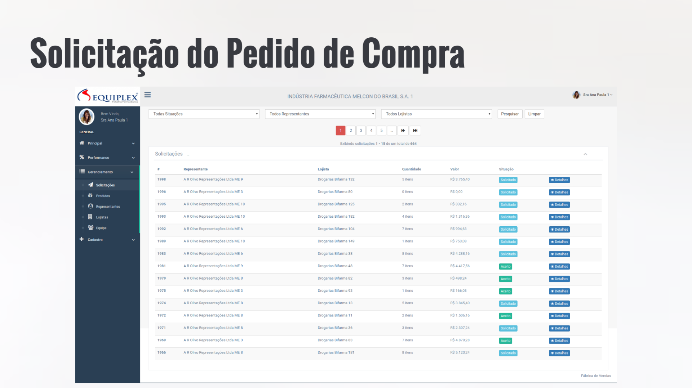
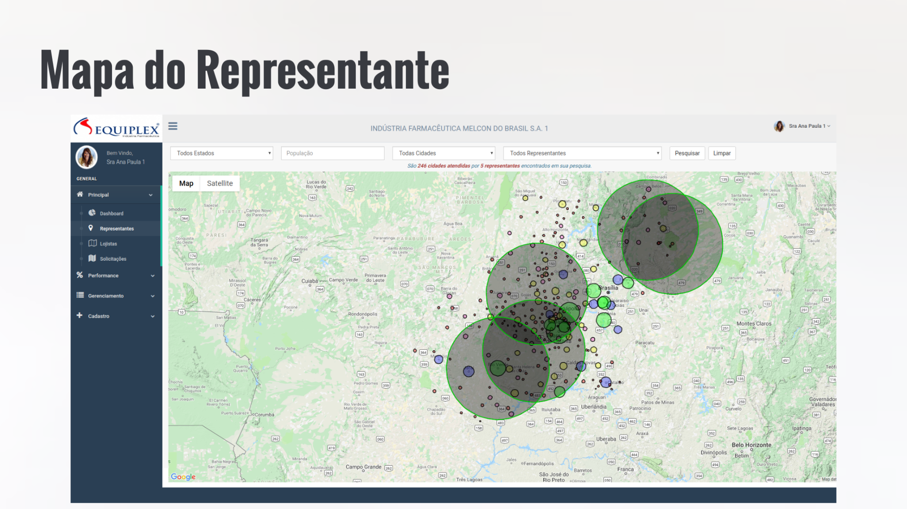
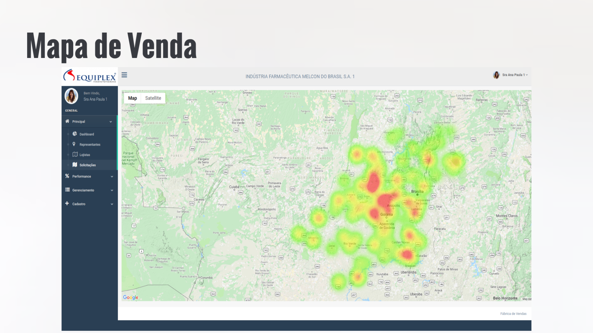
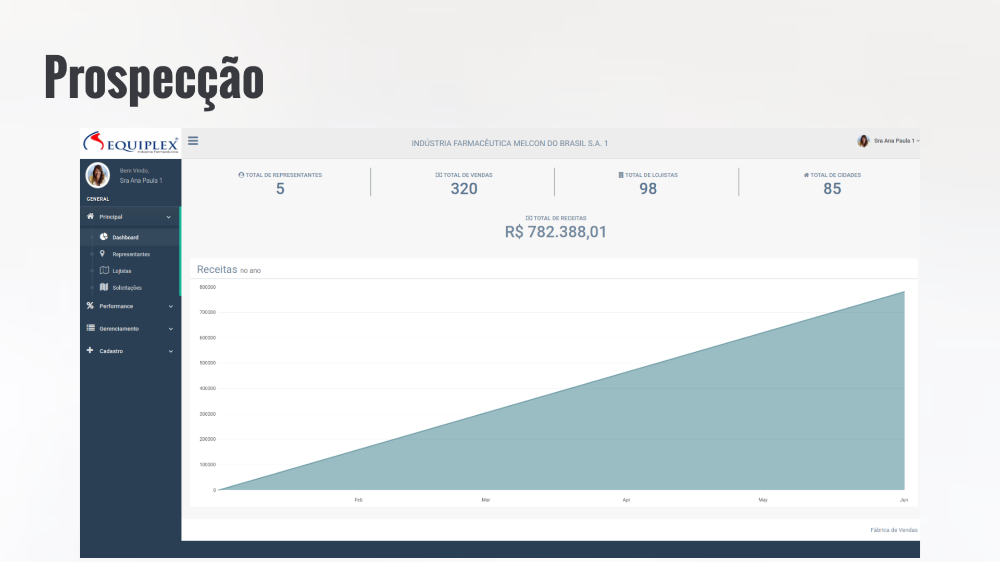

#Negocial
- [Apresentação](https://prezi.com/p/vvozg6zg_enz/?present=1)

##Principais Funcionalidades








#Variáveis de Ambiente

## Google Maps
-  ENV['GOOGLE_API_MAPS_JAVASCRIPT']

## Email Server
- ENV["DOMAIN_NAME"]
- ENV["SENDGRID_USERNAME"]
- ENV["SENDGRID_PASSWORD"]

## Image Server
- ENV['AWS_ACCESS_KEY_ID']
- ENV['AWS_SECRET_ACCESS_KEY_ID']
- ENV['AWS_REGION']
- ENV['AWS_BUCKET']

## Errbit Server
- ENV["ERRBIT_DOMAIN"]
- ENV["ERRBIT_PROJECT_ID"]
- ENV["ERRBIT_PROJECT_KEY"]

# TESTE
## Email Preview
http://localhost:3000/rails/mailers/usuario_mailer

# INFORMAÇÕES

## Deploy

### Heroku

```
heroku run bash
rails db:migrate 
rails c
Rails.application.load_seed
```
PS: Por algum muito motivo rodar o `rails db:seed` via `heroku run rails db:seed` não funciona

## Infraestrutura

- [Errbit (Digital Ocean)](https://github.com/errbit/errbit)
- [Email Server (Sendgrind)](https://app.sendgrid.com/guide/integrate/langs/smtp)
- [Maps Server (Google Maps)](https://console.cloud.google.com/google/maps-apis/overview?project=sale-factory-1534627059098)
- [Amazon IAM](https://console.aws.amazon.com/iam/home?region=us-east-2#/users)
- [Image Server (Amazon S3)](https://s3.console.aws.amazon.com/s3/buckets/active-storage-portal-agro/?region=us-east-2&tab=overview)

#QUALIDADE

## Qualidade de Código
```
shell> rubycritic app
```
Acesse: http://localhost:63342/sale-factory/tmp/rubycritic/overview.html


## Cobertura de Código

```
shell> rspec spec
```

Acesse: http://localhost:63342/sale-factory/coverage/index.html
