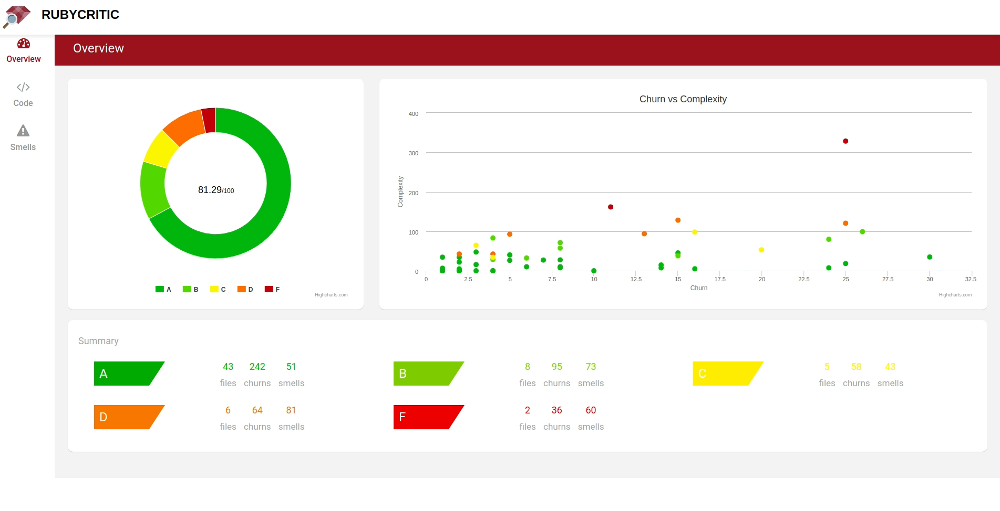
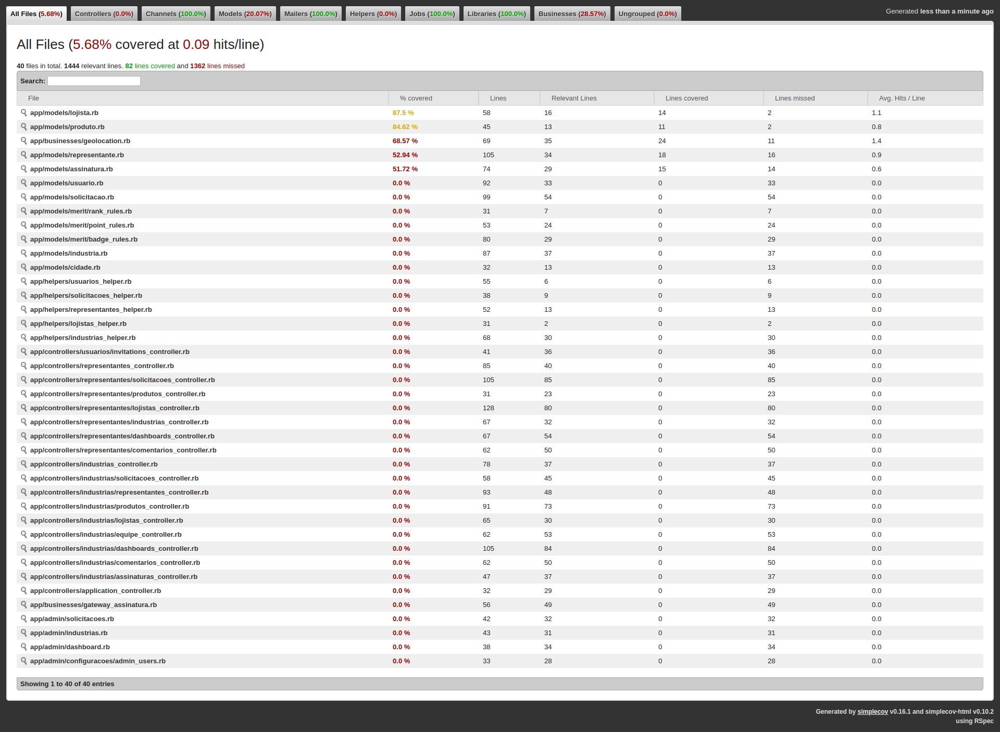

# Informações Negociais

Video de Apresentação do Negócio, clique na imagem

[](http://www.youtube.com/watch?v=qwTtnZBI7LM)

[Apresentação Completa no Prezi](https://prezi.com/p/vvozg6zg_enz/?present=1)

## Principais Funcionalidades

Video de Apresentação das Funcionalidades, clique na imagem

[](http://www.youtube.com/watch?v=QeYfnrnRKes)

# Informações Técnicas

## Variáveis de Ambiente

### PagarMe
-  ENV['API_KEY']
-  ENV['ENCRYPTION_KEY']

### Google Maps
-  ENV['GOOGLE_API_MAPS_JAVASCRIPT']

### Email Server
- ENV["DOMAIN_NAME"]
- ENV["SENDGRID_USERNAME"]
- ENV["SENDGRID_PASSWORD"]

### Image Server
- ENV['AWS_ACCESS_KEY_ID']
- ENV['AWS_SECRET_ACCESS_KEY_ID']
- ENV['AWS_REGION']
- ENV['AWS_BUCKET']

### Errbit Server
- ENV["ERRBIT_DOMAIN"]
- ENV["ERRBIT_PROJECT_ID"]
- ENV["ERRBIT_PROJECT_KEY"]

## Test
## Email Preview
http://localhost:3000/rails/mailers/usuario_mailer

## Running

> Clone o projeto

> Instale o ruby 2.6.6

> Agora execute

```
bundle install
rails db:create
rails db:migrate
rails db:seed 
rails s
```

## Quanlidade

### Qualidade de Código
```
shell> rubycritic app
```
Acesse: HOME_PROJECT/tmp/rubycritic/overview.html


### Cobertura de Código

```
shell> rspec spec
```

Acesse: HOME_PROJECT/coverage/index.html


## Infraestrutura
- [Errbit (Digital Ocean)](https://github.com/errbit/errbit)
- [Email Server (Sendgrind)](https://app.sendgrid.com/guide/integrate/langs/smtp)
- [Maps Server (Google Maps)](https://console.cloud.google.com/google/maps-apis/overview?project=sale-factory-1534627059098)
- [Amazon IAM](https://console.aws.amazon.com/iam/home?region=us-east-2#/users)
- [Image Server (Amazon S3)](https://s3.console.aws.amazon.com/s3/buckets/active-storage-portal-agro/?region=us-east-2&tab=overview)
